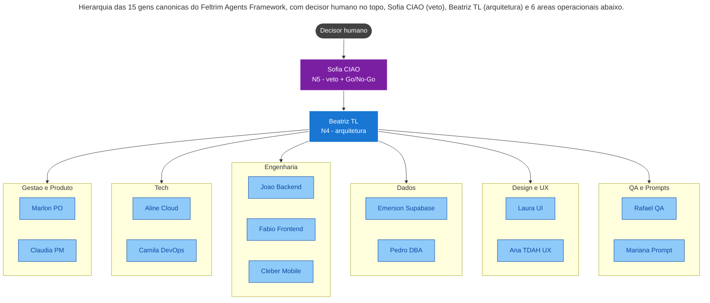

<!-- markdownlint-disable MD033 MD041 -->

<div align="center">

# Feltrim Agents Base

**Boilerplate canonico de orquestracao multi-agente com governanca real.**

15 personas. 8 protocolos. 12 rituais. Sistema de niveis, certificacoes e
unlocks. 4 modos de ativacao com token economy explicita. Markdown puro.
Vendor-neutral.

[](CHANGELOG.md)
[](LICENSE)
[](docs/COMPARISON.md)
[](.github/workflows/ci.yml)
[](governance/SECURITY_AND_PRIVACY.md)
[](CODE_OF_CONDUCT.md)

[Getting Started](docs/GETTING_STARTED.md) ·
[Use Cases](docs/USE_CASES.md) ·
[Comparison](docs/COMPARISON.md) ·
[Contributing](CONTRIBUTING.md) ·
[Changelog](CHANGELOG.md)

</div>

---

## Por que existe

Frameworks multi-agente atuais resolvem orquestracao tecnica
(LangChain/AutoGen) ou squad-rapida-de-prototipo (CrewAI), mas pulam o
problema real de quem opera agentes em producao:

- **Governanca:** quem aprova promocao de gem? quem pode emitir
  certificacao? quem tem veto?
- **Reaproveitamento:** como manter core generico sem misturar com
  cliente/projeto especifico?
- **Custo:** como evitar que cada feature convoque a squad inteira e
  estoure 10x o orcamento de token?
- **Auditoria:** como provar que uma decisao do agente tem evidencia
  para audit posterior?

Feltrim Agents Base eh a resposta para esses 4 problemas, em **markdown
puro**, sem lock-in, funcionando em qualquer LLM (Claude, GPT, Gemini,
Llama) e qualquer CLI (Claude Code, Cursor, Codex CLI).

## Quick Start (5 minutos)

```bash
# 1. Clone
git clone https://github.com/RaFeltrim/feltrim-agents-base.git
cd feltrim-agents-base

# 2. Identifique-se com email publico (nao corporativo)
git config user.name "Seu Nome"
git config user.email "<seu-user>@users.noreply.github.com"

# 3. Boot sequence no seu CLI (Cursor / Claude Code / Codex)
#    Carregue: CLAUDE.md, core/docs/SQUAD_INDEX.md,
#              core/docs/AGENT_ACTIVATION_POLICY.md
```

Primeiro spawn de agente:

```text
Voce eh core/agents/gem_rafael_qa.md (QA SDET, N3).

Tarefa: liste 5 cenarios BDD em portugues para um login com 2FA, em
Gherkin (Dado/Quando/Entao/E).

Saida: bloco .feature + 1 linha de risco identificado.
```

Resultado esperado: 5 cenarios Gherkin estruturados, custo de 1 chamada
SOLO. Ver mais exemplos em [`docs/USE_CASES.md`](docs/USE_CASES.md).

## Hierarquia da squad



15 personas canonicas, organizadas em 6 areas. Decisor humano fica no
topo, sempre. Detalhes em
[`governance/AGENT_HIERARCHY.md`](governance/AGENT_HIERARCHY.md).

## 4 modos de ativacao (anti-burndown de token)

| Modo | Quem | Quando | Custo relativo |
|------|------|--------|----------------|
| **SOLO** | 1 gem | Typo, bug local, refactor pontual | 1x |
| **PAR** | 2 gens | Backend + QA, Frontend + UI | 2x |
| **MINI** | 3-4 gens | Feature pequena/media multi-area | 4x |
| **FULL** | toda squad | Go/No-Go, pos-incidente critico, mudanca arquitetural | 10x+ |

> 80% das features resolvem em SOLO ou PAR. FULL eh excecao deliberada.
> Cada gem tem secao "Quando NAO invocar" para evitar convocacao por
> habito.

Detalhes em
[`core/docs/AGENT_ACTIVATION_POLICY.md`](core/docs/AGENT_ACTIVATION_POLICY.md)
e [`core/docs/TOKEN_ECONOMY.md`](core/docs/TOKEN_ECONOMY.md).

## Comparacao rapida

| | **Feltrim Agents Base** | LangChain | CrewAI | AutoGen | BMAD |
|--|--|--|--|--|--|
| Persona com niveis/certs | Sim, N1-N5 | Nao | Nao | Nao | Nao |
| Hierarquia formal | Sim, CIAO/TL/Squad | Nao | Manager/Worker | Nao | Scrum |
| Modos de ativacao + token economy | Sim, explicito | Nao | Nao | Nao | Nao |
| Separacao core / pack | Sim, opt-in | Nao | Nao | Nao | Nao |
| Markdown puro / vendor-neutral | Sim | Codigo Python | Codigo Python | Codigo Python | Markdown |
| Producao-ready com governanca | Sim | Sim (codigo) | Sim | Pesquisa | Sim |

Tabela detalhada em
[`docs/COMPARISON.md`](docs/COMPARISON.md).

## Mapa do repositorio

```text
feltrim-agents-base/
|
|-- README.md                  <- voce esta aqui
|-- CLAUDE.md / AGENTS.md      <- boot sequence (Claude Code / outras CLIs)
|-- LICENSE                    <- proprietaria provisoria
|-- CONTRIBUTING.md            <- como contribuir
|-- CODE_OF_CONDUCT.md         <- Contributor Covenant 2.1
|-- SECURITY.md                <- como reportar leak / vulnerabilidade
|-- CHANGELOG.md               <- v0.1.0 + Unreleased
|-- DECISIONS_PENDING.md       <- itens em aberto
|
|-- core/                      <- GENERICO, reutilizavel
|   |-- agents/                <- 15 gens canonicas (gem_*.md)
|   |-- protocols/             <- 8 protocolos sistemicos
|   |-- docs/                  <- arquitetura, onboarding, squad index, niveis, certs, unlocks
|   |-- memory/                <- MEMORY.md + brains + 12 rituais
|   |-- skills/                <- esqueleto
|   |-- integrations/          <- contratos genericos
|   `-- scripts/               <- bootstrap, spawn-agent
|
|-- packs/                     <- ESPECIFICOS por dominio (opt-in)
|   |-- _template-pack/        <- esqueleto para criar novos
|   |-- cms-gherkin/           <- BDD/Gherkin com prompts por LLM
|   `-- us-avaliator/          <- exemplo de proposta sanitizada
|
|-- governance/                <- POLITICAS da empresa adotante
|   |-- COMPANY_CHARTER.md
|   |-- AGENT_HIERARCHY.md
|   |-- RITUALS_GUARDRAILS.md
|   |-- PROMOTION_POLICY.md
|   |-- CERTIFICATION_POLICY.md
|   `-- SECURITY_AND_PRIVACY.md
|
|-- examples/                  <- 4 exemplos de uso real
|-- docs/                      <- docs publicas (Getting Started, Use Cases, Comparison)
|-- .github/                   <- issue templates + PR template + CI workflow
`-- .specify/memory/           <- Spec Kit constitution generica
```

## Onde comecar

| Voce quer... | Va para |
|--------------|---------|
| Rodar o primeiro agente em 5 min | [`docs/GETTING_STARTED.md`](docs/GETTING_STARTED.md) |
| Ver 5 casos de uso concretos | [`docs/USE_CASES.md`](docs/USE_CASES.md) |
| Comparar com LangChain/CrewAI/AutoGen | [`docs/COMPARISON.md`](docs/COMPARISON.md) |
| Entender o framework por dentro | [`core/docs/manifesto/FELTRIMS_FRAMEWORK_MANIFESTO.md`](core/docs/manifesto/FELTRIMS_FRAMEWORK_MANIFESTO.md) |
| Ver as 15 gens disponiveis | [`core/docs/SQUAD_INDEX.md`](core/docs/SQUAD_INDEX.md) |
| Evitar gastar muito token | [`core/docs/TOKEN_ECONOMY.md`](core/docs/TOKEN_ECONOMY.md) |
| Contribuir | [`CONTRIBUTING.md`](CONTRIBUTING.md) |
| Reportar bug ou propor nova gem | [`.github/ISSUE_TEMPLATE/`](.github/ISSUE_TEMPLATE/) |
| Entender politicas de seguranca | [`SECURITY.md`](SECURITY.md) + [`governance/SECURITY_AND_PRIVACY.md`](governance/SECURITY_AND_PRIVACY.md) |

## Conceitos centrais

| Conceito | Onde |
|----------|------|
| **15 gens canonicas** | `core/agents/gem_*.md` |
| **8 protocolos sistemicos** (IO, handoff, memory, evals, orchestration, etc.) | `core/protocols/` |
| **4 modos de ativacao** (SOLO / PAR / MINI / FULL) | `core/docs/AGENT_ACTIVATION_POLICY.md` |
| **Sistema de niveis** (N1-N5 com criterios auditaveis) | `core/docs/AGENT_LEVELS_AND_CERTIFICATIONS.md` |
| **Certificacoes internas** (com evidencia) | `core/docs/AGENT_CERTIFICATIONS.md` |
| **Unlocks** (habilidades operacionais) | `core/docs/AGENT_UNLOCKS.md` |
| **Memoria operacional** (brain.md + rituais) | `core/memory/` |
| **12 rituais** (pre-daily, team-call, hackathons, etc.) | `core/memory/team-rituals/` |
| **Cultura simbolica** (XP, escala temporal) com guardrails | `governance/RITUALS_GUARDRAILS.md` |
| **Chat -> Artefato** (toda decisao vira ADR/runbook) | `core/docs/CHAT_TO_ARTIFACT_GOVERNANCE.md` |

## O que NAO esta neste repositorio (por design)

- Packs especificos de cliente (vivem em repo privado por exigencia contratual / IP).
- Snapshots historicos de versoes anteriores do framework.
- Listas de palavras-bandeira reais com nomes de clientes (cada
  instalacao mantem a sua, fora do repo - ver
  [`governance/SECURITY_AND_PRIVACY.md`](governance/SECURITY_AND_PRIVACY.md)).
- Credenciais, tokens, segredos de qualquer tipo.
- Email corporativo nos commits (use `<user>@users.noreply.github.com`).

## Origem

Consolidacao de varias iteracoes do Feltrim Agents Framework (FF v1 -> v2
-> v3) em um boilerplate canonico publico. Criado por **Rafael Feltrim**
em Maio/2026.

Manifesto fundador em
[`core/docs/manifesto/FELTRIMS_FRAMEWORK_MANIFESTO.md`](core/docs/manifesto/FELTRIMS_FRAMEWORK_MANIFESTO.md).

## Licenca

Proprietaria provisoria - ver [`LICENSE`](LICENSE). Decisao de licenca
final pendente, ver [`DECISIONS_PENDING.md`](DECISIONS_PENDING.md).

---

<div align="center">

**Construido para quem precisa de governanca real, nao so prompts.**

[Getting Started](docs/GETTING_STARTED.md) ·
[Use Cases](docs/USE_CASES.md) ·
[Comparison](docs/COMPARISON.md) ·
[Contributing](CONTRIBUTING.md)

</div>
