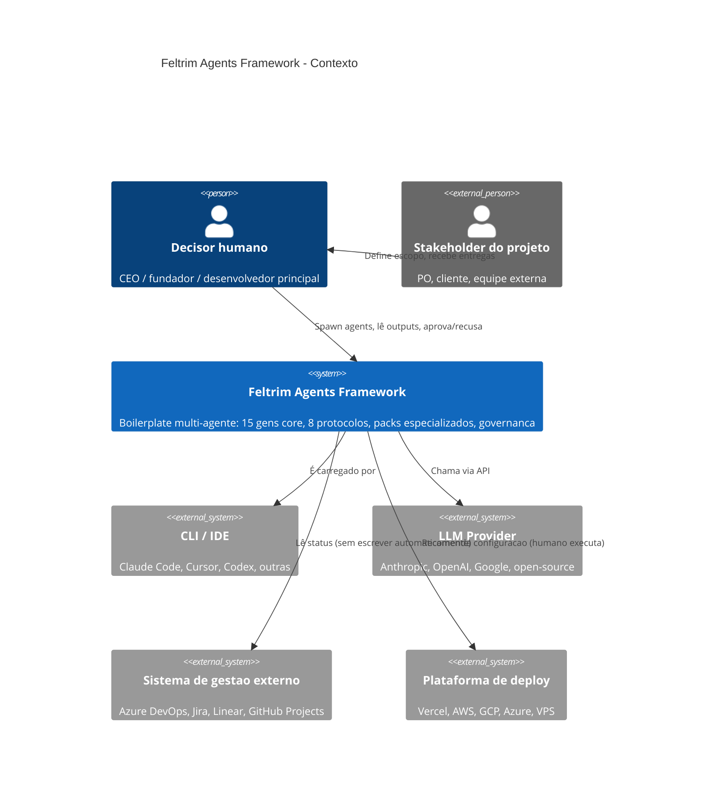
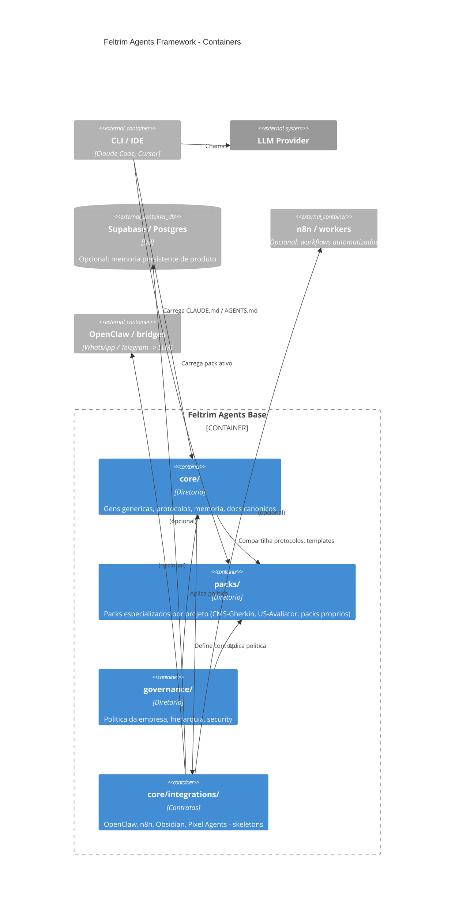

## Arquitetura - Feltrim Agents Framework (generica)

> Visao arquitetural canonica do Feltrim Agents Framework. Generica:
> aplicavel a qualquer projeto/empresa que use o boilerplate. Arquitetura
> especifica de packs vive em `packs/<pack>/docs/ARQUITETURA.md`.
>
> Notacao: C4 Model (Context, Container, Component, Code).

## Contexto (C4 nivel 1)

## Container (C4 nivel 2)

## Decisoes arquiteturais (ADRs genericos)

ADRs especificos vivem em `core/docs/adr/`. Direcoes consolidadas neste
boilerplate (pode virar ADR formal a qualquer momento):

### Memoria

- **Decisao:** memoria transacional dos agentes vive em arquivos
  versionados (`core/memory/`, `packs/<pack>/brains/`). Quando exigir
  performance / consulta, externalizar para Postgres (Supabase).
- **Justificativa:** Markdown + Git e auditavel, diffable, portavel.
  Bases NoSQL e Obsidian sao adequados para navegacao pessoal mas nao para
  fonte de verdade transacional.
- **Alternativa rejeitada:** Obsidian/Notion como fonte primaria. Razao:
  vendor lock-in e dificuldade de versionamento auditavel.

### Filas e workers

- **Decisao:** automacoes assincronas usam BullMQ (Node) ou equivalente
  por linguagem (Celery em Python, Sidekiq em Ruby).
- **Justificativa:** controle granular de concurrency, retry, observabilidade.
- **Anti-padrao:** disparar Playwright direto em request HTTP - precisa de fila.

### Bridges de chat

- **Decisao:** OpenClaw self-hosted (Node daemon) para WhatsApp/Telegram
  como bridge model-agnostic.
- **Justificativa:** evita lock-in em vendor de bot.
- **Alternativa rejeitada:** Twilio / vendor SaaS por simplicidade.
  Razao: custo escalonado e perda de controle de dados.

### Deploy

- **Decisao:** preferir PaaS gerenciado (Vercel, Cloudflare Pages,
  Supabase) ate o ponto onde precisar de container customizado ou
  background process; ai migrar para VPS self-hosted (Hetzner / Linode /
  DigitalOcean) com Docker Compose + reverse proxy.
- **Justificativa:** otimiza custo/complexidade no inicio, libera
  flexibilidade quando necessario.

### Boot sequence dos agentes

- **Decisao:** ordem canonica documentada em
  `core/protocols/AGENT_RUNTIME_WRAPPER.md`:
  1. Contexto do projeto
  2. Wrapper (este arquivo)
  3. AGENT_IO_CONTRACT
  4. HANDOFF_PROTOCOL
  5. MEMORY_AND_RAG_POLICY
  6. EVALS_AND_MONITORING
  7. Gem do agente
  8. Request packet da tarefa
- **Justificativa:** garante que a gem opere dentro do contrato e dos
  guardrails antes de ver a tarefa.

## Stack default (para projetos novos)

| Camada | Recomendacao default | Quando mudar |
|--------|----------------------|--------------|
| LLM provider | Anthropic Claude (sonnet/medium para agents, opus/large para decisoes criticas) | Custo / latencia / capacidade especifica |
| Frontend | React 19 + Zustand + Vite | Time prefere outro framework |
| Backend | Node.js (Express/Fastify/Hono) + BullMQ | Domino exige Python/Java |
| Banco | Postgres via Supabase | > 100k rows ou requisito on-prem |
| Workers | BullMQ + Redis | Volumetria justifica Kafka / Temporal |
| Cache | Redis | Cache de pagina pode ir para Cloudflare |
| Deploy frontend | Vercel | Requisito on-prem ou edge custom |
| Deploy backend | Vercel functions / VPS Docker | Background pesado -> VPS |
| CI/CD | GitHub Actions | Time ja usa GitLab CI / Buildkite |
| Observabilidade | Sentry + Vercel Analytics | Compliance exige self-hosted (Grafana) |

## Relacao com CLAUDE.md / AGENTS.md

- `CLAUDE.md` raiz: pointer minimo.
- `core/CLAUDE.md`: boot sequence canonico (a ser criado em PR futuro - hoje
  o pointer raiz e suficiente).
- `AGENTS.md` raiz: espelho para outras CLIs.
- Cada pack tem seu proprio `packs/<pack>/CLAUDE.md` quando o pack precisar
  override de boot.

## Veja tambem

- `core/docs/OPERATING_MODEL.md` - 10 pilares de sistema de agentes
- `core/docs/manifesto/FELTRIMS_FRAMEWORK_MANIFESTO.md` - principios fundadores
- `core/docs/manifesto/FELTRIMS_IDE_VISION.md` - visao IDE proprietaria
- `core/protocols/` - 8 protocolos canonicos
- `core/docs/adr/README.md` - como abrir um ADR
