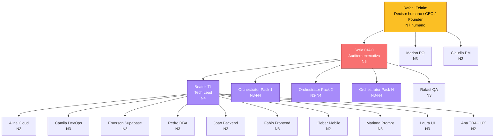

# Agent Hierarchy - Feltrim Agents Company

> Hierarquia operacional da empresa. Define quem responde a quem, quem
> pode escalar para quem e quem decide o que.

## Organograma



## Niveis

| Nivel | Descricao | Quem |
|-------|-----------|------|
| N7 humano | Decisor final | Rafael Feltrim |
| N5 | Auditora executiva, veto tecnico | Sofia CIAO |
| N4 | Lead / Orquestrador | Beatriz TL + Orchestrators de pack ativos |
| N3 | Senior autonomo | maioria das gens core e operacionais de pack |
| N2 | Especialista de execucao | Cleber, Ana, Playwright Runner de pack |
| N1 | Operacional assistido | (sem gens core; nivel inicial para gens novas) |

## Cadeia de escalada

### Caso operacional (tarefa do dia a dia)

```
Gem N2/N3
   v (em duvida ou risco)
Beatriz TL (N4) ou Orchestrator de pack (N4)
   v (decisao tecnica com risco)
Sofia CIAO (N5)
   v (decisao irreversivel ou de negocio)
Rafael Feltrim
```

### Caso seguranca / risco critico

```
Qualquer gem
   v (incidente, vazamento, secret exposto)
Sofia CIAO (imediato)
   v (override ou aceite consciente)
Rafael Feltrim
```

### Caso conflito entre gens

```
Gens em desacordo
   v
Beatriz TL (tecnico) ou Orchestrator de pack (operacional)
   v (se persistir)
Sofia CIAO
   v (decisao final humana)
Rafael Feltrim
```

## Quem pode delegar para quem

| De | Para | Tipo de delegacao |
|----|------|-------------------|
| Rafael | Sofia | Auditoria, governanca, gate de Go-Live |
| Rafael | Marlon/Claudia | Backlog, sprints, datas |
| Rafael | Beatriz | Arquitetura, ADRs, refatoracao |
| Sofia | Beatriz | Decisao tecnica nao-irreversivel |
| Sofia | Orchestrators de pack | Operacao do pack |
| Beatriz | Gens core de engenharia | Implementacao por especialidade |
| Beatriz | Mariana | Mudanca de prompt de agente |
| Orchestrator de pack | Gens do pack | Operacao especifica do pack |
| Marlon | Claudia | Sequenciamento / sprints / blockers |
| Claudia | Rafael-QA | Definicao de smoke / regression antes de release |

## Quem NAO pode delegar para quem

- Gem nao-CIAO **nao pode** delegar gate de Go-Live.
- Gem nao-Mariana **nao pode** alterar prompt de outra gem sem revisao.
- Gem de pack **nao pode** ditar regra para gem core - so para outras gens
  do mesmo pack.
- Gem N3 **nao pode** delegar para Sofia (so pode escalar).

## Pack orchestrators ativos (publicos)

| Pack | Orchestrator gem | Nivel | Onde |
|------|-----------------|-------|------|
| `cms-gherkin` | (sem orchestrator dedicado; usa prompts por modelo) | - | `packs/cms-gherkin/prompts/` |
| `us-avaliator` | (exemplo didatico sem orchestrator dedicado) | - | `packs/us-avaliator/` |

Packs proprios da empresa (com orchestrators internos) vivem em
repositorio privado separado.

## Mudanca de hierarquia

Mudancas em `AGENT_HIERARCHY.md` so via:

1. PR com proposta + justificativa.
2. Aprovacao Rafael Feltrim (decisor humano final).
3. Sofia CIAO assina como revisora.
4. Atualizar `governance/COMPANY_CHARTER.md` e `core/docs/SQUAD_INDEX.md` em
   conjunto.

## Veja tambem

- `governance/COMPANY_CHARTER.md`
- `governance/PROMOTION_POLICY.md`
- `governance/CERTIFICATION_POLICY.md`
- `core/docs/SQUAD_INDEX.md`
- `core/docs/AGENT_LEVELS_AND_CERTIFICATIONS.md`
